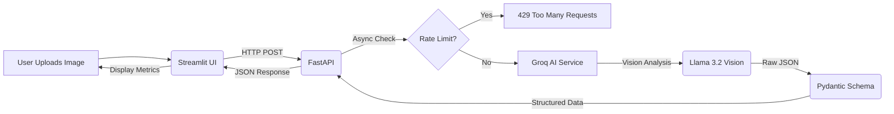

# 🧾 AI Receipt Parser
A full-stack AI application that converts unstructured receipt images into structured JSON data using Groq vision API.

## 🚀 Live Demo
* **Frontend**: [\[here\]](https://receipt-parser-frontend.onrender.com)

* **Backend API Docs**: [\[here\]](https://receipt-parser-backend.onrender.com/docs)


# AI-Powered Receipt Extraction 

This project is an AI-powered extraction system. It solves the problem of manual data entry by allowing users to upload a photo of a receipt and instantly getting back structured data (**Store Name**, **Date**, **Total**, **Tax**, **Line Items**).

It uses **Groq's llama-4-scout Vision model** to scan the image and **Pydantic** to strictly validate the output, ensuring the data is clean and ready.

## ✨ Key Features

* **👀 Visual Intelligence:** Uses Large Multi-Modal Models (LMMs) to read text from images, handling complex layouts better than traditional OCR.

* **🛡️ Robust Validation:** Implements strict Pydantic models. If the AI hallucinates a date format, the backend catches and corrects it (or flags it) before it reaches the UI.

* **⏱️ Custom Rate Limiting:** Features a custom-built, sliding-window rate limiter (Async/No-Dependency) to protect the API from abuse and manage 3rd-party token limits.

* **🐳 Fully Containerized:** Split into Microservices (Frontend & Backend) orchestrated via Docker Compose.

* **📊 Interactive Dashboard:** A Streamlit UI that visualizes extraction confidence, tax breakdowns, and itemized lists in real-time.


## 🛠️ Tech Stack

### Backend 
* **Framework:** FastAPI
* **Language:** Python 3.11
* **AI Provider:** Groq SDK (llama-4-scout)
* **Validation:** Pydantic 

### Frontend 
* **Framework:** Streamlit

## 🚀 Getting Started
### Prerequisites
* Docker installed
* A Groq API Key (Get one at [Groq](https://console.groq.com/home))

## 1. Clone the Repository**
```bash
git clone https://github.com/Aman00240/RECEIPT-PARSER
cd RECEIPT-PARSER
```
## 2. Configure Environment

Create a `.env` file in the root directory:

```env
GROQ_KEY=groq_api_key
MODEL=meta-llama/llama-4-scout-17b-16e-instruct
```

## 3. Run with Docker Compose
This builds both services and sets up the internal network.
```bash
docker-compose up --build
```
* **Frontend**: Open http://localhost:8501

* **Backend Documentation**: Open http://localhost:8000/docs


## 🏗️ Architecture Flow



## 📂 Project Structure

```text
.
├── app/
│   ├── routers/
│   │   └── receipts.py      # API Endpoints
│   ├── services/
│   │   └── vision.py        # Groq Integration & Prompt Engineering
│   ├── config.py            # Environment Settings
│   ├── main.py              # FastAPI Entrypoint
│   ├── schemas.py           # Pydantic Data Models
│   └── utils.py             # Rate Limiter Logic
├── frontend/
│   └── ui.py                # Streamlit Dashboard
├── Dockerfile               # Backend Image
├── Dockerfile.frontend      # Frontend Image
├── docker-compose.yml       # Orchestration
└── requirements.txt         # Dependencies for backend image
└── requirements_frontend.txt # Dependencies for frontend image
```

## 🔌 API Usage

The API comes with interactive documentation via Swagger UI.
Once running, navigate to: **`http://localhost:8000/docs`**

### Quick CLI Test
You can also test the endpoint directly from your terminal:

```bash
curl -X POST "http://localhost:8000/receipts/scan" \
     -H "accept: application/json" \
     -H "Content-Type: multipart/form-data" \
     -F "file=@/path/to/receipt.jpg"
```    
**Response Example:**

```json
{
  "store_name": "Store",
  "total_amount": 14.50,
  "tax_amount": 1.20,
  "scan_confidence":1,
  "items":[
    {"item_name": "Milk", "price": 4.50}
  ]
}
```

